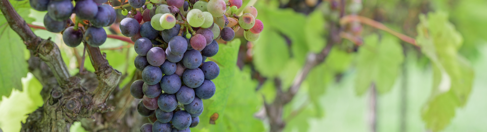

# In Vino Veritas
### A Wine Quality Prediction Project
#### by Heather Ortega McMillan



## Project Overview

### Goals
With this project I aim to create a machine learning model to predict the quality of a wine based on it's physicochemical properties. I also dive into determining key drivers in the wine quality.
This Dataset was acquired through UCI's Machine Learning Repository and can be found [here](https://archive-beta.ics.uci.edu/ml/datasets/186)

### About this Data

This dataset has physicochemical measurements for 6497 different red and white wines, that were all produced in Portugal. It also has an average rating of this wine on a scale from 0 (being very poor) to 10 (being excellent). For the scope of this project, I divided the wine into three categories. bad wines (rating < 4), average wines (rating 5 - 6), and good wines (ratings > 7). Due to privacy and logistic issues, only physicochemical (inputs) and sensory (the output)variables 
are available (e.g. there is no data about grape types, wine brand, wine selling price, etc.).

#### What is a physicochemical property? 
Well, that just means the physical and chemical properties of a wine. Such as alcohol content, acidity, sweetness, etc. All those things you learn about when going to a wine tasting. These are chemical and physical measurements of these various properties. For example the measure of alcohol is measured in % vol, or what's also known as ABV. For some background reading on wine tasting take a look at [this article](https://www.thespruceeats.com/how-to-taste-wine-3511356).

#### What's in a wine?
On the first sip most educated wine enthusiasts can get a good idea of the following four things: alcohol content, tannin levels, acidity, and residual sugar. They then look for flavor of the wine, and the body of the wine (is it light-bodied, medium-bodied, etc. think density). Because there is such an art to tasting wines, the nuance of the unique flavors, the balance of the different attributes, it would be difficult to just put a number on these things. You'll see that the attributes in this data set are doing their best to do just that. It will be impossible to capture that nuance in just numbers alone, for how can numbers capture the that hint of oakiness mixed with apple residing in your favorite bottle of wine. But with some of the key components quantifiable (alcohol, acidity, density, etc), we might be able to use this information to predict the next top rated wine, before it's even touched the tongue of a sommelier.


### Findings

I was able to create a Random Forest model that predicts the quality rating of the wine (as bad, average or good) better than the baseline, with an 80% accuracy. This tool can help winemakers get a better idea of the reception of their product before it hits the shelf. This could be of real benefit to less experienced wine makers who are just starting out and don't quite have their tasting skills down yet. 

The top 3 factors that distinguish bad wines from good wines are:

``` 'alcohol', 'volatile_acidity', 'free_sulfur_dioxide'```

These qualities, backed up by statistical testing concludes that these are important features of a wine to look out for when creating a batch of wine, because they can have an impact on the reception of that wine in the market. Take a look at the [Stats Testing](#stats_testing) section of this notebook.

With more time I would like to refine the model to be better at predicting low rated wines. This way these types of wines can be avoided or modified during the manufacturing process.

## Data Citation Info
Title: Wine Quality

Citation: 

P. Cortez, A. Cerdeira, F. Almeida, T. Matos and J. Reis. 
Modeling wine preferences by data mining from physicochemical properties.
In Decision Support Systems, Elsevier, 47(4):547-553. ISSN: 0167-9236.

  Available at: [@Elsevier](http://dx.doi.org/10.1016/j.dss.2009.05.016)
                [Pre-press (pdf)](http://www3.dsi.uminho.pt/pcortez/winequality09.pdf)
                [bib](http://www3.dsi.uminho.pt/pcortez/dss09.bib)

The two datasets are related to red and white variants of the Portuguese "Vinho Verde" wine.
For more details, consult: http://www.vinhoverde.pt/en/ or the reference Cortez et al., 2009.
Due to privacy and logistic issues, only physicochemical (inputs) and sensory (the output) variables 
are available (e.g. there is no data about grape types, wine brand, wine selling price, etc.).

### Project Process
- For the planning of this project I utilized a [Trello Board](https://trello.com/b/cRhauhJS/wine-ds-project).
- I went through the stages of the data science pipeline and documented everything in the 
[final_notebook](https://github.com/HeatherOrtegaMcMillan/in_vino_veritas/blob/main/final_notebook.ipynb).
- Data was acquired (from sources above) and prepared, explored, and ultimately used to create a classification model.
- 3 custom function modules were created [prepare.py](https://github.com/HeatherOrtegaMcMillan/in_vino_veritas/blob/main/prepare.py), [explore.py](https://github.com/HeatherOrtegaMcMillan/in_vino_veritas/blob/main/explore.py), and [model.py](https://github.com/HeatherOrtegaMcMillan/in_vino_veritas/blob/main/model.py)


### Data Dictionary

A * indicates an engineered feature. These were mostly done for the target in order
to put the wines into categories for exploring and modeling. 
The three categories are bad wines (rating <= 4), average wines (rating between 5-6),
and good wines (rating >= 7).


| Column Name                | Use       | Type            | Description                                                                                                                                                                                                                                                                                                                                                                                                                                                                             |
|----------------------------|-----------|-----------------|-----------------------------------------------------------------------------------------------------------------------------------------------------------------------------------------------------------------------------------------------------------------------------------------------------------------------------------------------------------------------------------------------------------------------------------------------------------------------------------------|
| `quality`                  | Target    | int64           | Average quality rating of the wine. 0 being worst 10 being best                                                                                                                                                                                                                                                                                                                                                                                                                         |
| `quality_bins`             | Target*   | int64           | Bins created to represent bad (0), average (1) and good (2) wines.                                                                                                                                                                                                                                                                                                                                                                                                                      |
| 'quality_bins_str'         | Target*   | Object          | Same bins as `quality_bins` but data is represented in a string for readability                                                                                                                                                                                                                                                                                                                                                                                                         |
| `is_good`                  | Target*   | int64 (boolean) | Wine has rating of 7 or higher                                                                                                                                                                                                                                                                                                                                                                                                                                                          |
| `is_bad`                   | Target*   | int64 (boolean) | Wine has rating of 4 or lower                                                                                                                                                                                                                                                                                                                                                                                                                                                           |
| `fixed acidity`            | Variable  | Float64         | Fixed acids include tartaric, malic, citric, and succinic acids which are found in grapes (except succinic). This variable is usually expressed in  g(tartaricacid)/dm3  in the dataset.                                                                                                                                                                                                                                                                                                 |
| `volatile acidity`         | Variable  | Float64         | These acids are to be distilled out from the wine before completing the production process. It is primarily constituted of acetic acid though other acids like lactic, formic and butyric acids might also be present. Excess of volatile acids are undesirable and lead to unpleasant flavor. In the US, the legal limits of volatile acidity are 1.2 g/L for red table wine and 1.1 g/L for white table wine. The volatile acidity is expressed in  g(aceticacid)/dm3  in the dataset. |
| `citric acid`              | Variable  | Float64         | This is one of the fixed acids which gives a wine its freshness. Usually most of it is consumed during the fermentation process and sometimes it is added separately to give the wine more freshness. It's usually expressed in  gdm3  in the dataset.                                                                                                                                                                                                                                  |
| `residual sugar`           | Variable  | Float64         | This typically refers to the natural sugar from grapes which remains after the fermentation process stops, or is stopped. It's usually expressed in  gdm3  in the dataset.                                                                                                                                                                                                                                                                                                              |
| `chlorides`                | Variable  | Float64         | Chloride concentration in the wine is influenced by terroir and its highest levels are found in wines coming from countries where irrigation is carried out using salty water or in areas with brackish terrains. This is usually a major contributor to saltiness in wine. It's usually expressed in  g(sodiumchloride)/dm3  in the dataset.                                                                                                                                            |
| `free sulfur dioxide`      | Variable  | Float64         | This is the part of the sulphur dioxide that when added to a wine is said to be free after the remaining part binds. Winemakers will always try to get the highest proportion of free sulphur to bind. They are also known as sulfites and too much of it is undesirable and gives a pungent odour. This variable is expressed in  mgdm3  in the dataset.                                                                                                                               |
| `total sulfur dioxide`     | Variable  | Float64         | This is the sum total of the bound and the free sulfur dioxide ( SO2 ). Here, it's expressed in  mgdm3 . This is mainly added to kill harmful bacteria and preserve quality and freshness. There are usually legal limits for sulfur levels in wines and excess of it can even kill good yeast and give out undesirable odour.                                                                                                                                                          |
| `density`                  | Variable  | Float64         | This can be represented as a comparison of the weight of a specific volume of wine to an equivalent volume of water. It is generally used as a measure of the conversion of sugar to alcohol. Here, it's expressed in  gcm3 .                                                                                                                                                                                                                                                           |
| `pH`                       | Variable  | Float64         | Also known as the potential of hydrogen, this is a numeric scale to specify the acidity or basicity the wine. Fixed acidity contributes the most towards the pH of wines. You might know, solutions with a pH less than 7 are acidic, while solutions with a pH greater than 7 are basic. With a pH of 7, pure water is neutral. Most wines have a pH between 2.9 and 3.9 and are therefore acidic.                                                                                     |
| `sulphates`                | Variable  | Float64         | These are mineral salts containing sulfur. They are connected to the fermentation process and affects the wine aroma and flavor. Here, it's expressed in  g(potassiumsulphate)/dm3  in the dataset.                                                                                                                                                 |
|  `alcohol`                 | Variable  | Float64         | Measured in % vol or ABV (Alcohol by Volume)                                                                                                                                                                                                                                                                                                                                                                                                                                            |
| `is_white`                 | Variable* | int64 (boolean) | Boolean value indicating if the wine is white. If 0 wine is red. This is from joining the red and white wine data sets together.                                                                                                                                                                                                                                                                                                                                                        |


* indicates an engineered feature


## Re Creation
If you wish to recreate this project download the csv files for [red wine](https://archive.ics.uci.edu/ml/machine-learning-databases/wine-quality/winequality-red.csv) and [white wine](https://archive.ics.uci.edu/ml/machine-learning-databases/wine-quality/winequality-white.csv) and save them to your repo. Then you can run this notebook. Check out the [README](https://github.com/HeatherOrtegaMcMillan/in_vino_veritas/blob/main/README.md) for the skills required. More information about this data can be found [here](https://www.kaggle.com/rajyellow46/wine-quality).

1. Read the README.md
2. Download the prepare.py, explore.py, model.py and final_notebook.ipynb files into your working directory, or clone this repository 
3. Ensure your csv files are named appropriately ('winequality-red.csv' and 
'winequality-white.csv', should be defaults from links above) 
4. Run the final_notebook.ipynb notebook

### Skills Required
Technical Skills
- Python
    - Pandas
    - Seaborn
    - Matplotlib
    - Numpy 
    - Sklearn

- Statistical Analysis
    - Descriptive Stats
    - Hypothesis Testing
    - T-test

- Classification Modeling
    - Random Forest
    - Logistical Regression
    - KNN
    - Baseline Accuracy
    - Decision Tree
    - Model Selection
    - SMOTE

